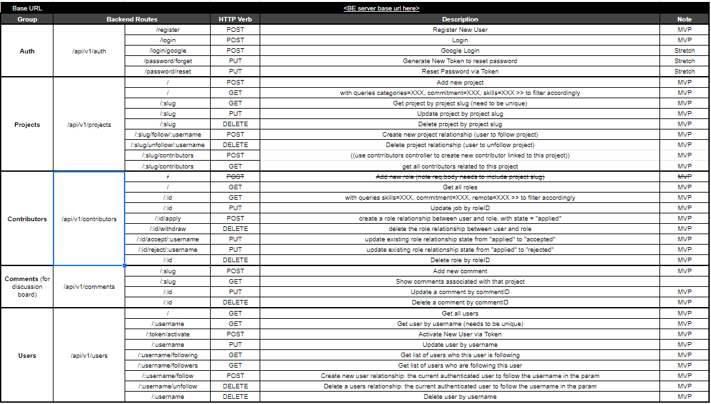
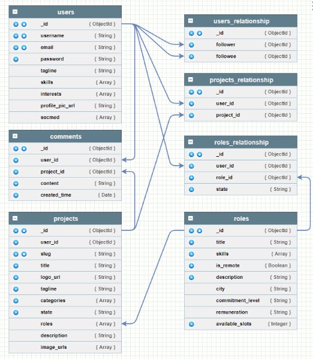

# Hello World - server side

## About

Hello World is an app where like minded people can come together to share project ideas, meet new and interesting friends and find contributors for their projects. It's Linkedin for developers!

Note that screenshots of wire frames and user stories will be included in the front end repo.

## Links

Server - https://express-hello-world-zmw.herokuapp.com/

Front end - https://hello-world-zmw.netlify.app/

Front end GitHub - https://github.com/will-j-c/react-hello-world

## Tech Stack

In the backend, the tech stack was:

* Express - Routing
* Mongo DB Atlas and Mongoose - Database
* Multer and Imagekit - To handle photo uploads
* Sendgrid Mail - To handle sending confirmation tokens to users
* Various assorted packages for CORS, Git and validation

## Planning and Execution

The team initially suggested ideas to each other until we had a list to choose from. Once we had settled on Hello World, we had a planning session at GA campus where we mapped out features and drew basic wire frames on the whiteboard. 

With the white board session done, the routes and data schema were designed to incorporate the views and features that had been designed. 

We then spent a solid week on designing each view in figma and getting the flow and styling correct.

The back end was then prioritised, being substantially completed in one weekend to leave plenty of time to build the front end.

## Issues faced

The backend development was relatively straightforward and benefited from substantial planning. The process ran relatively smoothly with only minor hiccups.

One challenge was implementing authorisation on various routes. This required effort from all the team to map out the logic for all the cases.

## Routes

Below are a list of routes used in the app:

## Database schema

Below is the database schema and relationships:

